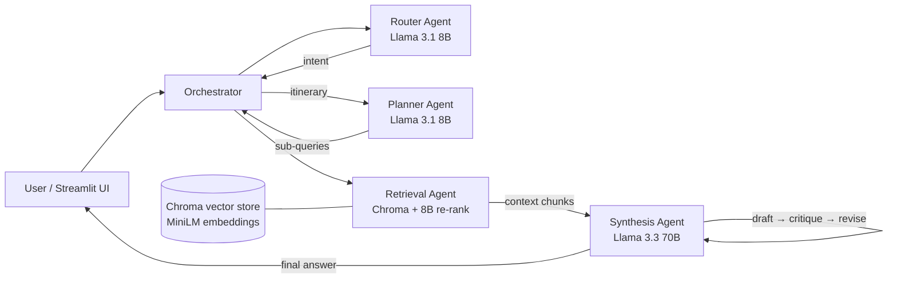
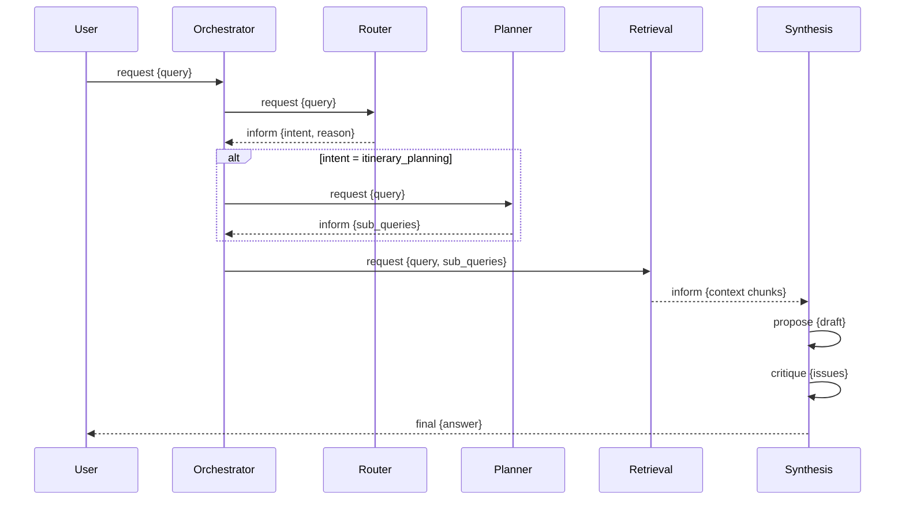

# 🧭 PathFinder LK — Agentic AI Travel Assistant for Sri Lanka

A multi-agent, RAG-grounded travel assistant that answers destination questions
and plans multi-day Sri Lanka itineraries, grounded in a curated local-knowledge
corpus.

**Problem (Option A — real-world):** independent travellers to Sri Lanka juggle
scattered, often stale information about seasons, transport quirks and
attraction logistics. PathFinder LK combines a curated local corpus with a
multi-agent pipeline so answers are grounded, cited, and itinerary-aware.

**Live demo:** _<https://pathfinder-lk-agent-9mb59yttaerhfmnfvsdguy.streamlit.app/>_

---

## Architecture



## Agentic design patterns

| #   | Pattern                           | Where in code                                                                                                                           |
| --- | --------------------------------- | --------------------------------------------------------------------------------------------------------------------------------------- |
| 1   | **Router**                        | `agents/router_agent.py` — classifies each query into `destination_info` / `itinerary_planning` / `out_of_scope` and gates the pipeline |
| 2   | **Planning / task decomposition** | `agents/planner_agent.py` — breaks an itinerary request into 2–5 focused retrieval sub-queries                                          |
| 3   | **Tool use**                      | `agents/retrieval_agent.py` — invokes the Chroma vector store as an external tool, then LLM-re-ranks candidates                         |
| 4   | **Reflection / self-critique**    | `agents/synthesis_agent.py` — `propose → critique → revise` loop before the final answer                                                |
| 5   | **Orchestrator–worker**           | `orchestrator.py` coordinates all worker agents                                                                                         |

## Agent-to-agent communication

All agents exchange **structured `AgentMessage` objects** (`protocol.py`) — a
custom protocol inspired by A2A/FIPA speech acts. Each message carries a
`trace_id` (follow one query across every agent), a `performative`
(`request | inform | propose | critique | final | reject`), an optional
`intent`, and a pydantic-validated `content` payload. The full message trace is
rendered in the UI under every answer.



## Model selection strategy

Both models are served via **Groq**.

| Sub-task                        | Model (provider)               | Why chosen                                                                                                                                                                                                                                                       |
| ------------------------------- | ------------------------------ | ---------------------------------------------------------------------------------------------------------------------------------------------------------------------------------------------------------------------------------------------------------------- |
| Intent routing                  | Llama 3.1 8B Instant (Groq)    | Very low latency and near-free per token; a 3-way classification does not need a large model, and routing sits on every request's critical path. Measured in testing: **5/5 routing accuracy at ~277 ms average**, including a code-mixed Sinhala/English query. |
| Itinerary decomposition         | Llama 3.1 8B Instant (Groq)    | Structured extraction into JSON sub-queries — small context, simple reasoning, speed matters                                                                                                                                                                     |
| Retrieval re-ranking            | Llama 3.1 8B Instant (Groq)    | Must score ~8 chunks per sub-query without becoming a bottleneck; relevance judgement is within 8B capability                                                                                                                                                    |
| Final synthesis + self-critique | Llama 3.3 70B Versatile (Groq) | Runs once per query, so its higher cost/latency is acceptable; itinerary writing and grounded critique need substantially better reasoning and instruction-following than 8B provides                                                                            |

## RAG pipeline

- **Corpus:** `data/corpus/` — markdown documents on Sri Lankan destinations,
  transport, seasons and logistics (target: 20+ documents).
- **Chunking:** paragraph-aware sliding window, 800 characters with 150-character
  overlap (`rag/ingest.py::chunk_text`), so chunks rarely split a sentence.
- **Embeddings:** `all-MiniLM-L6-v2` (sentence-transformers) — free, local, fast.
- **Vector store:** **Chroma**, persistent on disk at `chroma_db/` (gitignored;
  auto-rebuilt on first boot if missing).
- **Retrieval:** top-8 by embedding similarity → LLM re-rank → top-4 chunks
  forwarded with source metadata; the synthesis agent cites sources like `[ella.md]`.

Rebuild the index after editing the corpus:

```bash
python -m rag.ingest
```

## Architecture validation

`notebooks/PathFinderLK_Architecture_Testing.ipynb` contains the executed
Phase-2 test run: the message protocol, a working router agent, and measured
results (routing accuracy, latency, and a JSON-parse-failure edge case with the
fallback behaviour analysed).

## Setup (local)

```bash
git clone https://github.com/nawodyaweragoda-cyber/pathfinder-lk-agent.git
cd pathfinder-lk-agent
python -m venv venv && venv\Scripts\activate   # Windows
pip install -r requirements.txt

copy .env.example .env      # then put your real GROQ_API_KEY into .env
python -m rag.ingest        # build the vector store
streamlit run app.py
```

### Secrets management

The Groq key is read from `.env` locally or `st.secrets` on Streamlit Cloud
(`config.py::get_groq_api_key`). `.env` and `.streamlit/secrets.toml` are
gitignored; **no key ever appears in source code or commit history**.

## Deployment (Streamlit Cloud)

1. Push to GitHub.
2. share.streamlit.io → New app → this repo, branch `main`, file `app.py`.
3. App settings → Secrets → add `GROQ_API_KEY = "..."`.
4. First boot takes a few minutes: dependencies install, the embedding model
   downloads, and the Chroma index is auto-built (cold-start hook in
   `rag/retriever.py`). `.streamlit/config.toml` disables the file watcher to
   avoid a known Streamlit/PyTorch watcher clash.

## Known limitations

- Corpus is hand-curated and static; prices and timetables can go stale.
- The 8B models occasionally emit malformed JSON; a fallback defaults to
  `out_of_scope` (observed once in testing). Planned fix: Groq JSON mode
  (`response_format={"type": "json_object"}`) or a single retry.
- Reflection runs a single critique-revise cycle, not an iterative loop.
- No live data (weather, train bookings) — RAG only.
- Re-ranking with an 8B model occasionally keeps a marginal chunk.

## Tools & libraries used

Python, Streamlit, Groq API (Llama 3.1 8B Instant, Llama 3.3 70B Versatile),
ChromaDB, sentence-transformers (all-MiniLM-L6-v2), pydantic, python-dotenv.
AI assistance (Anthropic Claude) was used during development for code
scaffolding and debugging; architecture decisions, testing, corpus curation and
analysis are my own, and all generated code has been reviewed and is understood
by me. <!-- Adjust this disclosure to match your course's AI-use policy. -->

## Repository practice

Feature branches merged into `main` via pull requests:
`feature/agents`, `feature/rag-pipeline`, `feature/model-router`,
`feature/streamlit-ui`, `docs/readme`. Semantic commit messages throughout
(`feat:`, `fix:`, `docs:`, `chore:`, `test:`, `refactor:`).
